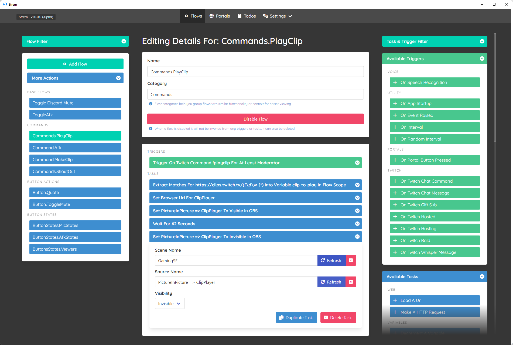
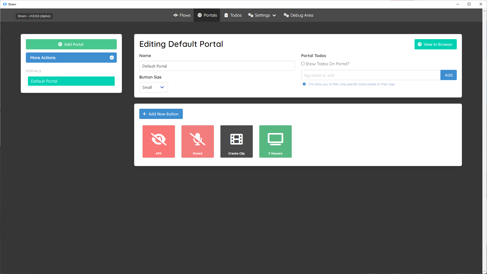

# Strem
A free and open source automation tool geared for assisting streamers.

[![Documentation][gitbook-image]][gitbook-url] [![Discord][discord-image]][discord-invite-url]

> Currently we are only building for windows officially, but custom cut down builds can probably be built for other platforms.

## What Does It Do?

It lets you build complex logic `flows` from `triggers` and `tasks` which can drive actions in 3rd party apps/tools like OBS and Twitch.

> For example you may want to play a meme on OBS every time chat contains "lollerskates", so you would make a twitch chat trigger, and have a task to show an obs source.

### Features
- Simple to use application (open source + plugin mechanism)
- Integrations with `OBS` from tasks/triggers (v28 or with v4 websocket plugin)
- Integrations with `Twitch` to trigger chat, commands, donations etc
- Integrations with `Twitter` to send tweets
- Smart Variables (Allows variables to be tied to contexts, i.e one `death-count` variable for each game)
- Sub Flow Support (Express branching logic in flows, i.e `if statements` with multiple possible outcomes)
- `Todo` system to let you auto generate reminders to do things during/after streams
- `Portal` system lets you setup buttons to drive your `Flows`

> Currently this is the most ALPHA of all alphas, so by all means use it, but just keep in mind this is SUPER early days.

## How Do I Install/Run It?
Just go to [releases](https://github.com/strem-app/strem/releases/latest), download the latest zip file and put it in a directory somewhere and run `strem.exe`

> Currently only windows is supported, but only a few things realistically require windows so in the long run we may pull those dependencies out to support other platforms too (i.e file browsing, keyboard input simulation, tts etc).

The only integrations supported out of the box currently are `Twitch` and `OBS`, however we only have a small subset of available triggers/tasks available for the moment to assist with testing, these will rapidly get fleshed out as more time is spent..

> For the moment the docs are sparse, feel free to ask questions in issues though and more docs will be provided in the `docs` folder as time goes by.

## HALP!

Here are some of the existing tutorials for how to do basic use cases for the app:

> These may not be 100% accurate as the app is changing rapidly due to it being fairly new, but the general high level approaches should still be relevant.

### Creating A Death Counter (Per Game)

### Create Todos From Commands (Or Anything)

### How To Delete Flows

## OBS Integration Isnt Working!?
The out the box OBS integration we use is meant for v28+ of OBS which internally contains a web socket server, you will need to enable that.

> If you use the [v4 websocket server plugin](https://github.com/obsproject/obs-websocket/releases/tag/4.9.1), you will need to go and download the [Strem.Plugins.OBS.v4 Plugin](https://github.com/strem-app/Strem.Plugins.OBS.v4) which will add support for the older OBS websocket server.

## I Want To Add To This Project

Thats great, for the moment everything is VERY fluid so while im open to taking PRs and FRs just keep in mind I want to stabilize stuff a bit further before I open the flood gates a fully.

To build it locally you will to:

- Make sure you have `.net 6.0`
- Pull > Nuget Restore > Run
- Read Stuff In [docs](./docs) folder

> Once loaded if you go into `Logs` you will be able to see where your data source files live and information around whats happening at runtime.

[gitbook-image]: https://img.shields.io/static/v1.svg?label=Documentation&message=Read%20Now&color=Green&style=flat
[gitbook-url]: https://strem.gitbook.io/strem-app/
[discord-image]: https://img.shields.io/discord/1029317879461580800.svg
[discord-invite-url]: https://discord.gg/H5xKhDeUCk
