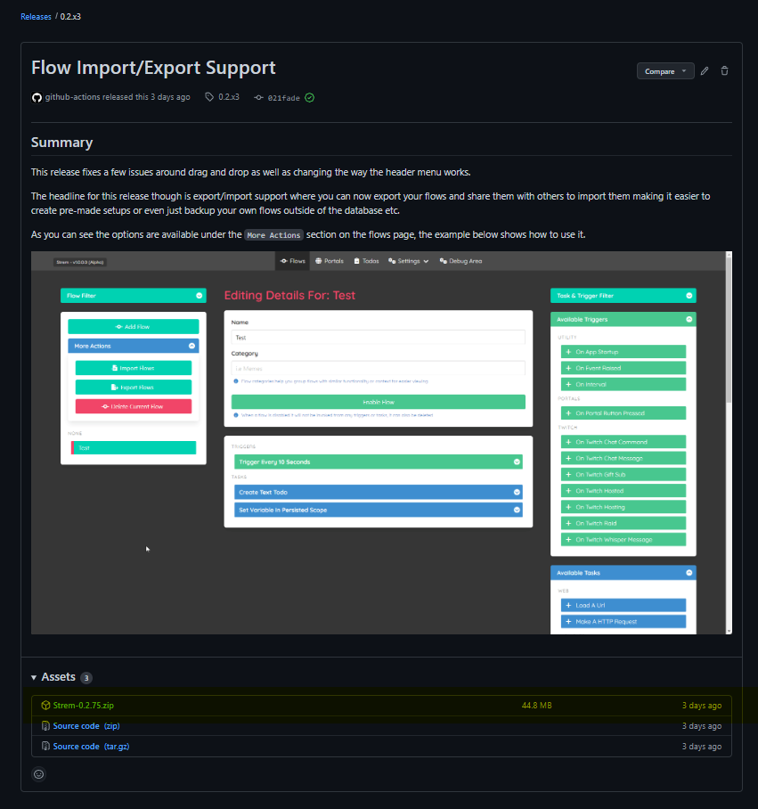
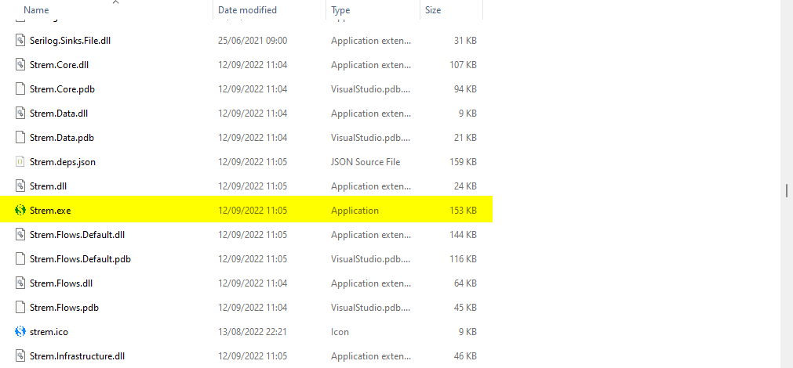

# Installing Strem App

Installing the app is really easy, and doesn't come with an install as such.

> Currently only Windows is supported but given the underlying tech it can hopefully be built for other platforms such as Mac and Linux too.

## Getting the latest version

If you head on over to the [Github Releases](https://github.com/strem-app/strem/releases/) and pick the most recent one you should see a screen like this:

From here you can see the highlighted area which contains the `Strem.<version>.zip` file, just click on that to download it, then unzip it to wherever you want.

> The application stores the data independently for each user in their `appdata/roaming` folder so you can have multiple user accounts share the same installation.

## Running the app

Once you have unzipped the application to your given folder you should find a `Strem.exe` file in there which you can double click on to load the application.

> Windows SmartScreen may flag this executable as it is not signed, this is something to look at in the future but unfortunately costs money.

Once you have loaded the application you should see the splash screen and the `Flow` page asking you to create a flow, which means you are ready to get started making flows.