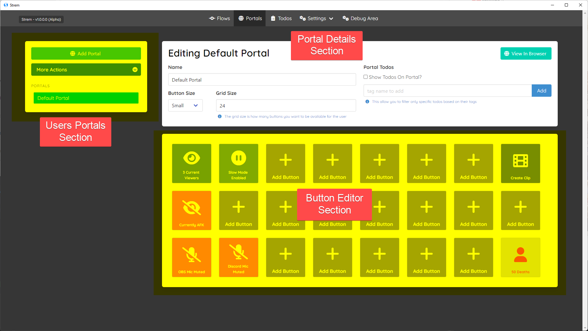
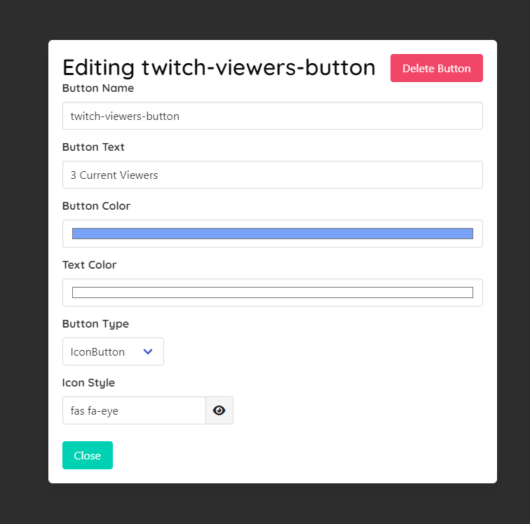
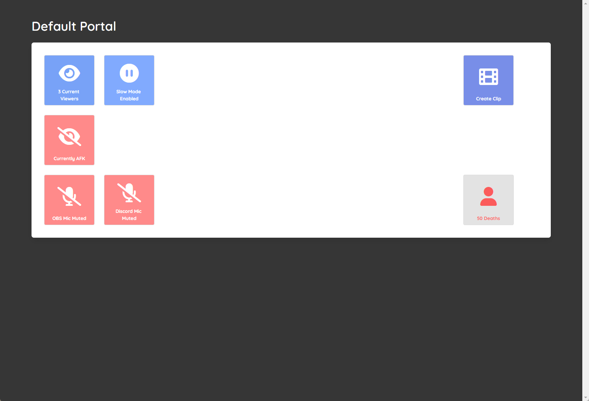
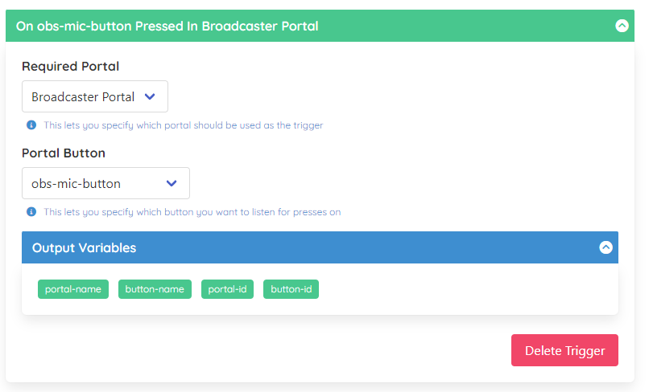

# Portals

Portals allow you to setup user interfaces that can be used to drive your flows via button press triggers.

From here you can setup as many portals as you want each being configured with whatever functionality you would want to trigger from a browser or tablet/phone while you are streaming.

> You can also show todo lists in the portal so you have all the crucial information within one place to action.

## What Is A Portal?

A portal allows you to setup a front end like a virtual stream deck to be able to trigger flows whenever you want, this way you do not need to faff about manually within the `Strem` app you can just do it via the portal.

> For example imagine you wanted a button to mute/unmute your OBS mic you could setup a flow that does this that is `Triggered` by the button press, and then updates the `Button's` style via a `Task`.

It is also worth noting that these portals are exposed via the apps internal web server so you can access it by clicking the `View In Browser` button, which will load this in a web browser.

For security you can lock this down via your local firewall to whatever devices you want to have access to it, however if you wanted to you can also expose your portals to your mods or other trusted members of staff and allow them to have a cut down `Portal` that allows them to do certain things i.e creating clips, actioning todos, triggering timed events etc.

## Portal Sections

There are 3 main parts to the portal, which can be broken down into the `Users Portals` section on the left, with the top right being the `Portal Details` section and the bottom being the `Button Editor` as you can see below.

### User Portals Section

As previously mentioned you can create as many portals as you want here, but most users will probably only have a single portal but you can configure and expose as many as you want.

You can also `Delete`, `Import` and `Export` your `User Portals` from the `More Actions` section within the section.

### Portal Details Section

This is where you can alter the name of the portal and related high level details such as the button sizes/amounts, as well as being able to add the todo section to a portal if you want to see live filtered todos.

### Button Editor

This is probably the most important part of the page where you can drag and drop your buttons to place them where you want as well as add and remove any buttons you want.

You can click on any empty button or click an existing button to load the `Button Editor`, which lets you alter the default look of a button.

> It is worth noting that the button `Name` is used for binding purposes within the system so if you want to trigger your flows from buttons its the `Name` field which you will be using, so you can have different `Text` while keeping the `Name` succinct.

## Portal Viewer

Now we have covered most of the `editor` functionality the last part to cover is the `Portal Viewer` which lets you view and interact with your created portals on your browser/phone/tablet as shown below.

As you can see you will be able to see all the buttons/todos that you have configured. If you press any of the buttons here (via mouse or touch) it will `trigger` any flows which rely upon that button.

> You can make any updates you want in the back end and they will automatically be updated into the viewer in real time, so you can make alterations to buttons/portals at runtime without worrying about things being updated.

### Password Protection

Given you can share portals with anyone (i.e mods or staff) you can password protect portals which will require a correct password before the portal will be usable by anyone.

## Using Portals With Flows

With creating portals covered we now need to look at how we hook our portals into our `flows` which is really easy to do.

### Triggering Flows From Buttons

There is a `trigger` which can be used that lets you specify a `portal` and a `button` that will be used to drive the flows.

As you can see in the above image we select our required `portal` and `button` which will then automatically be flagged when the button is pressed within the `portal viewer`.

### Updating Buttons From Flows

The other part to this is updating button state from flows, which again is easy enough to do with the change button styles task as shown below.

You can see that you are able to alter any aspect of the button to reflect what is currently happening. You only need to change the bits you care about, and in most cases you would probably want to pair this with an `if statement task` which lets you alter the state based on conditions.